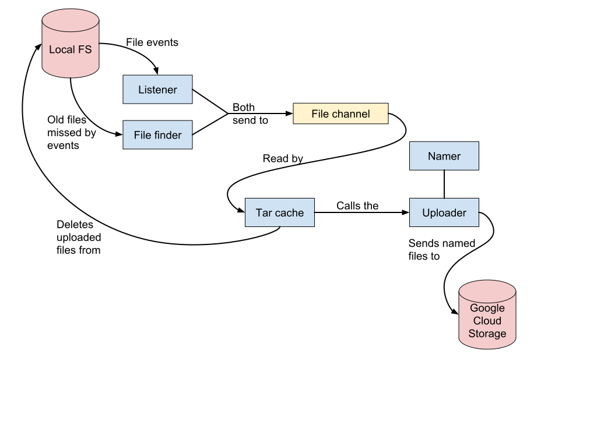

Pusher Requirements and Design

Authors | [pboothe@google.com](mailto:pboothe@google.com), [soltesz@google.com](mailto:soltesz@google.com)
--------|---------------
Last Updated | 2018-09-18

# 1. Objective

For experiments running on the M-Lab platform, we provide a service ("pusher") that scans a local “target directory” and uploads experiment data to an archive in Google Cloud Storage (GCS). The service runs as a “sidecar” container to the experiment container with minimal fuss. The experiment writes to the target directory and pusher reads, archives, and deletes files from the same directory.

# 2. Background

Measurement Lab (a.k.a M-Lab, [https://www.measurementlab.net](https://www.measurementlab.net)) has the mission: measure the Internet, save the data, and make it universally accessible and useful. The "save the data" part begins with getting experiment data off of M-Lab test servers and onto non-ephemeral storage, and doing so in a generic-enough way that researchers who write experiments don't have to think about it.

We used to have an rsync job running in Google's internal production infrastructure that would scrape M-Lab nodes using some internal tools for contacting servers outside of Google's internal production infrastructure. Later, we replaced that with [Scraper](https://github.com/m-lab/scraper), a system that ran on Google Kubernetes Engine and used rsync to download data from M-Lab servers. As we built the new M-Lab platform, however, a much simpler solution opened up: have the test servers themselves push the data to GCS. This was previously impractical, because our prior platform [OA&M](https://en.wikipedia.org/wiki/Operations,_administration_and_management) software had no way of putting secrets on machines, so we had no way of safely allowing access from machines to cloud resources, and so we were forced to adopt a "pull" model.

M-Lab’s new platform uses Kubernetes for OA&M. Experiments are built and managed as Docker containers. Kubernetes has native support for secret management and secure key distribution.

Currently, scraping the platform involves a [GKE](https://cloud.google.com/kubernetes-engine/) cluster with 200+ cloud VMs, 3000+ deployments, and PersistentVolumeClaim objects totalling 100T+. This adds lots of complexity to M-Lab's production systems and represents a lot of computational infrastructure that we would like to no longer have to maintain, run, or be responsible for in any way.

The interface we want to give to the world with Pusher is: a target directory that, when written to, causes the data to eventually appear in compressed tarfiles in Google Cloud Storage. We still want to keep our tarfiles and we don't want to provide the ability for the experiment to delete archived files, so [GCSFUSE](https://github.com/GoogleCloudPlatform/gcsfuse) is out. We want to keep things as simple as possible, and as uncoupled from the experiments as possible. So we have made [Pusher](https://github.com/m-lab/pusher).

# 3. Overview

Pusher is an inotify-based service that listens for `CLOSE_WRITE` and `MOVE_TO` events from a target directory (and all subdirectories), and adds all newly-found data files to a tarfile buffered in RAM. When that tarfile is big enough (for experiments that produce a lot of data) or old enough (for experiments which produce small data files) then the tarfile is uploaded to Google Cloud Storage and local files removed.

Inotify event delivery is not guaranteed. Servers may be power-cycled unexpectedly. So to guarantee that every file is accounted for, pusher also runs a cleanup job that looks for very old files in the target directory and also adds those old files to the tarfile. Ideally this cleanup job will never find anything, but computers being what they are it is likely that it will occasionally find something.

The pusher service will run in a container, and the target directory (e.g. `/var/spool/<experiment>`) will be mounted in both the filesystem of the experiment container and the filesystem of the pusher container. As the experiment writes data files to that directory, the pusher builds up an in-memory tarfile and uploads it to GCS with an appropriate name once the size or age thresholds are met for the tarfile contents.

The final system ends up being pretty radically simple (and small - only 619 lines of Go for the main code and 922 lines for the unit and integration tests), which, to the authors of this doc, is the sign of a well-designed solution fitting inside a well-designed system.

# 4. Pusher's API Contract

Pusher will monitor one directory, and all subdirectories of that directory, for the appearance of new, complete files. As files appear, they will be added to an in-memory compressed tarfile. When the tarfile is big enough or old enough, it will be uploaded to a bucket in Google Cloud Storage and named appropriately.

Pusher requires that the files it uploads be:

* **Only closed once.** Once a file is closed after writing (or moved to the directory), it should never be opened for writing again. Pusher assumes ownership of the file after the file is closed, and Pusher reads files immediately after taking ownership of them.

* **Not needed by the system after being closed.** Once a file is closed (or moved to the directory), Pusher assumes ownership of the file, and that includes assuming that it is no longer needed and may be deleted after upload.

* **Not too old and not too gradually updated.** A tunable parameter for Pusher is an age limit. By default it is two hours. If the last-modified time of a file is more than two hours in the past, Pusher assumes that the file's `CLOSE_WRITE` event was missed (because delivery of those events is not guaranteed) and that the file is eligible for upload. Files that linger open for more than two hours without being modified therefore run the risk of being uploaded prematurely.

In exchange for obeying that contract, the experimenter gets an extremely simple interface: a directory where all files written to that directory will appear in tarfiles in GCS, and all the experimenter has to do is write them to that directory.

## 4.1. Best practices for clients

### Do

* Use a subdirectory of `/var/spool` as the target directory. The name of the subdirectory should be same as the name of the experiment.

* One data file per test result (e.g. one upload test should create one file)

* File names must be written in a date-and-time-specifying subdirectory format like `/var/spool/myexperiment/2008/04/22/15:04:05.0001212.results.txt`

* Feel free to put IP addresses in the file name if that makes sense for your experiment, but make sure your code works with both IPv4 and IPv6.

* For filenames, stick with the alphabet, numbers, underscores, colons, periods, and dashes - and even then, be careful with the periods to ensure your filenames never start with a period or have two periods in a row.

* Add some sort of fixed string to the main body of the filename so that even if every component string ends up null, you won't write to a file named just `.gz` (a real example we have had happen to us in a real experiment - that file was very hard to notice, thanks to shell file hiding rules).

* Ensure that any and all filenames passed in pass the tests of [the filename linter in the TarCache module](https://github.com/m-lab/pusher/blob/master/tarcache/tarcache.go#L307).

### Don't

* Don't keep files open in the target directory for days and dribble data into them

* Don't put data in the target directory that should not be uploaded

* Don't assume that anything you write to the target directory will be available for subsequent reading

* Don't call close() on a file in the target directory and then reopen it for continued processing.

    * Real example: Don't save the file to disk and then use gzip to convert it to a .gz file. Instead, either generate the .gz file directly without the intermediate file, or save the intermediate somewhere else on the disk (e.g. `/tmp`) and then move the final compressed file to the data directory.

* Do not put any user-submitted bytes in the filenames

    * Do not use reverse-DNS to generate file names or pieces of file names

    * Almost anything in the file contents is fine, but random or user-submitted bytes in filenames is just asking for trouble. 

* Don’t remove files created in the target directory. Pusher will do that after successful upload.

# 5. Detailed Design

The service requires us to listen for the creation of files, occasionally search for any files whose messages were missed, tar and compress all discovered files, and to upload the resulting tarfile to Google Cloud Storage. Our design takes advantage of Go's channels to have a structure which mirrors the requirements.




All blue boxes in the diagram have corresponding Go modules in the Pusher code.

Pusher will run on the M-Lab node in its own container as a sidecar to the experiment container, and its only point of contact with the experiment container that generates data will be the single target directory that is mounted by both pusher and the experiment. If multiple different types of experiment are room by a single container, then that container should have multiple pusher sidecars attached, each listening to an independent directory. 

Pusher generates monitoring metrics available for Prometheus, on a configured port.

## 5.1. Listener

The listener uses the inotify filesystem interface for Linux, and listens to all `CLOSE_WRITE` and `MOVED_TO` events to discover new files appearing in the target directory and all its subdirectories. When a new file is discovered, it is immediately opened for stat-ing and its filename is saved, and then that information is passed along a channel connected to the TarCache system.

## 5.2. File Finder

Because inotify event delivery is not guaranteed and there are potential race conditions inherent to the system when new directories are created, we also have a backup way of discovering any files which are sufficiently old that we feel confident they should have already been uploaded and deleted, but somehow they were not. The file finder is an IO-intensive process, and so must not be run too often, but it is also a necessary complement to the Listener. In an effort to prevent thundering herds of IO, the find processes should be staggered in time in a memoryless fashion, to prevent multiple pushers from synchronizing and running the local disk out of IOps.

All discovered files are passed along the same channel that the listener uses, connected to the TarCache system.

## 5.3. File channel

The file channel takes in the information about files that should be uploaded and is read by the components which tar and upload those files. It should have a large buffer, to ensure that, except in extremis, the discovery of new files is never delayed by the uploading of files.

## 5.4. Namer

The namer generates names for the tarfiles based on the mlab node name, the experiment name, and the UTC timestamp of the upload time. The upload time is used (as opposed to the minimum file mtime or anything else like that) because it is the only counter that (local time adjustments aside) can be depended upon to monotonically increase, and as such is guaranteed not to generate collisions in the produced file name. The names it generates should look like:

`ndt/2006/01/02/20060102T150405.000Z-mlab1-lax03-ndt.tgz`

## 5.5. Tar Cache

This is the heart of the system. It gradually builds up in-memory tarfiles, and then when those in-memory tarfiles exceed a size or age threshold (configurable, but 20MB and 2 hours have been suggested as good starting points) the file is uploaded.

After successful upload of a tarfile, all its component files are deleted. If the upload fails, the upload is retried until it finally succeeds using exponential backoff (with sensible bounds to prevent too-large growth in the backoff time). During a period of GCS outage, file names and metadata will be buffered internally, but no new file contents are read until the upload has succeeded. We should not and will not buffer file contents in RAM if we can't upload file contents successfully.

If the GCS outage continues, eventually the disk will fill up and the machine will become unhealthy. This is by design, and the machine should return to good health after GCS comes back and the backed up data is automatically drained.

## 5.6. Uploader

The uploader gets the name from the Namer and then uploads the file to the bucket with that name.

## 5.7. Main

The only job of the main function is to assemble these components in the shown manner and then start all the subprocesses.

# 6. Caveats

If files can't be uploaded, then they will remain on disk and, as the experiment runs, fill the disk. This is right and good, but full disks cause problems. The directories used for data for pusher should be on a partition separate from the main system, to ensure that GCS reachability problems don't cause the host itself to become unstable.

# 7. Security Considerations

Pusher pushes experiment data to archival storage. It uses a secret it gets from Kubernetes to authenticate itself to GCS. We should be (and are) careful with this secret.

Most of the dangers to pusher come from poorly written experiments.

* Pusher will push anything given to it. Poorly written experiments could generate dangerous filenames and pusher will generate warnings, but will still upload the files. But those filenames could potentially do harm to poorly-written downstream analysis systems.

* Pusher will write anything given to it. If a poorly written experiment saves things it shouldn't, then pusher will too.

If pusher is misconfigured to (for example) push `/etc`, that would be bad. It will, if it has sufficient permissions, tar and upload the contents of `/etc` and then delete all the files in `/etc` it has permission to delete. Needless to say, this would be a bad idea. Do not make pusher push things that aren't data or things that are needed by the system as a whole. Do not put your hand in the crushing machine: it will cause your hand to be crushed by the machine.

# 8. Monitoring

Pusher will replace Scraper and we must have comparable monitoring for data collection.

For example, if we expect uploads to progress regularly, the following alert rule could fire if pusher does not upload successfully at least every 12 hours.

```
ALERT Pusher_LastSuccessfulUploadTooOld
IF (time() - pusher_success_timestamp) > 12 * 60 * 60
FOR 10m
...
```
